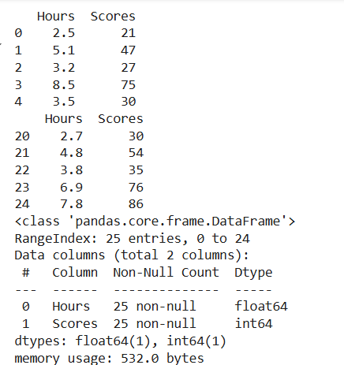
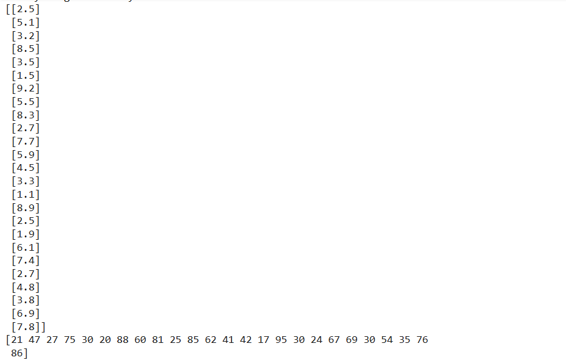
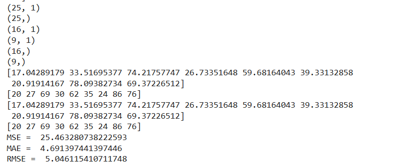
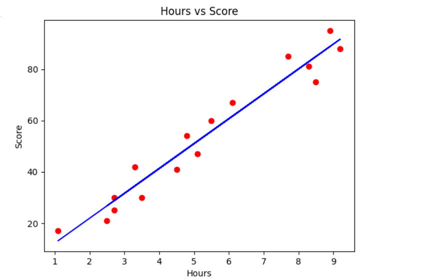
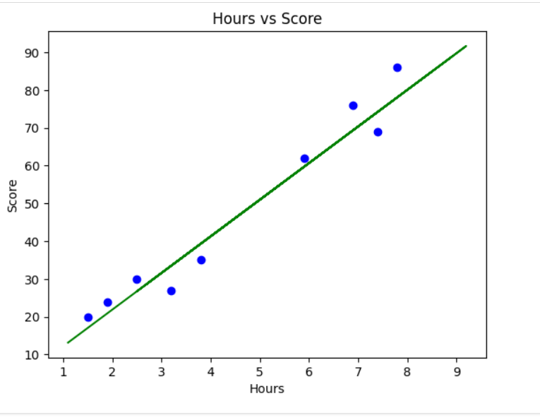

# Implementation of Univariate Linear Regression
## AIM:
To implement univariate Linear Regression to fit a straight line using least squares.

## Equipments Required:
1. Hardware – PCs
2. Anaconda – Python 3.7 Installation / Jupyter notebook

## Algorithm
1. Get the independent variable X and dependent variable Y.
2. Calculate the mean of the X -values and the mean of the Y -values.
3. Find the slope m of the line of best fit using the formula. 


4. Compute the y -intercept of the line by using the formula:

5. Use the slope m and the y -intercept to form the equation of the line.
6. Obtain the straight line equation Y=mX+b and plot the scatterplot.

## Program:
```
/*
Program to implement univariate Linear Regression to fit a straight line using least squares.
Developed by: ARULARASI U
RegisterNumber: 212223100002 
*/
```
```
import numpy as np
import pandas as pd
from sklearn.metrics import mean_absolute_error,mean_squared_error
import matplotlib.pyplot as plt
from sklearn.model_selection import train_test_split
from sklearn.linear_model import LinearRegression
dataset=pd.read_csv('student_scores.csv')
print(dataset.head())
print(dataset.tail())
dataset.info()
x=dataset.iloc[:,:-1].values #starts from first untill the last before column
print(x)
y=dataset.iloc[:,1].values #only the last column is extracted
print(y)
print(x.shape)
print(y.shape)
x_train,x_test,y_train,y_test=train_test_split(x,y,test_size=1/3,random_state=0)
print(x_train.shape)
print(x_test.shape)
print(y_train.shape)
print(y_test.shape)
from sklearn.linear_model import LinearRegression
regressor=LinearRegression()
regressor.fit(x_train,y_train)
y_pred=regressor.predict(x_test)
print(y_pred)
print(y_test)
from sklearn.linear_model import LinearRegression
regressor =LinearRegression()
regressor.fit(x_train,y_train)
y_pred=regressor.predict(x_test)
print(y_pred)
print(y_test)
mse=mean_squared_error(y_test,y_pred)
print('MSE = ',mse)
mae=mean_absolute_error(y_test,y_pred)
print('MAE = ',mae)
rmse=np.sqrt(mse)
print('RMSE = ',rmse)
plt.scatter(x_train,y_train,color='red')
plt.plot(x_train,regressor.predict(x_train),color='blue')
plt.title('Hours vs Score')
plt.xlabel('Hours')
plt.ylabel('Score')
plt.show()

plt.scatter(x_test,y_test,color='blue')
plt.plot(x_train,regressor.predict(x_train),color='green')
plt.title('Hours vs Score')
plt.xlabel('Hours')
plt.ylabel('Score')
plt.show
````

## Output:






## Result:
Thus the univariate Linear Regression was implemented to fit a straight line using least squares using python programming.
